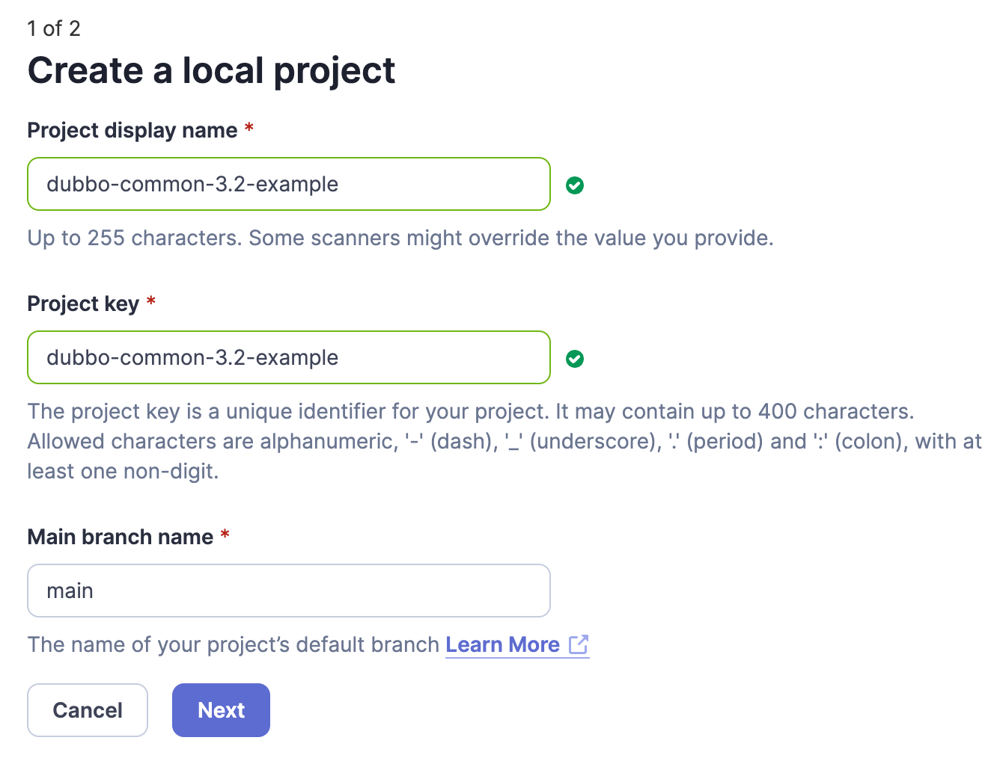
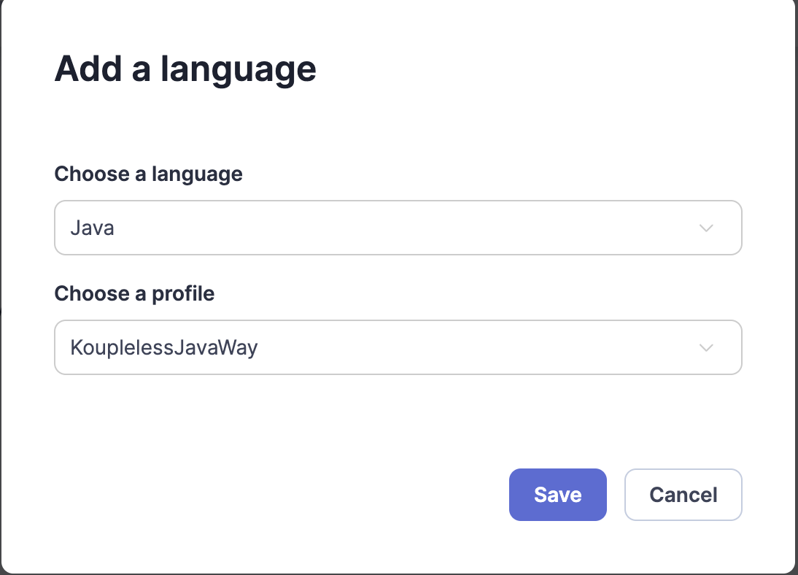
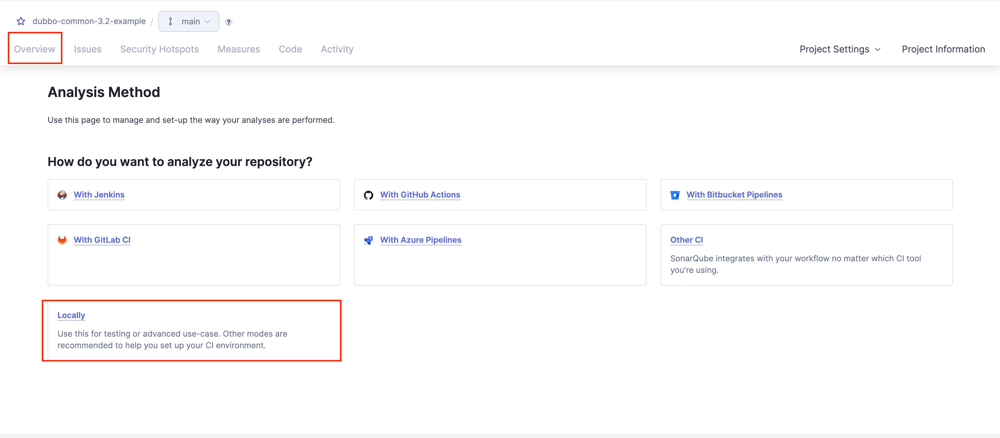
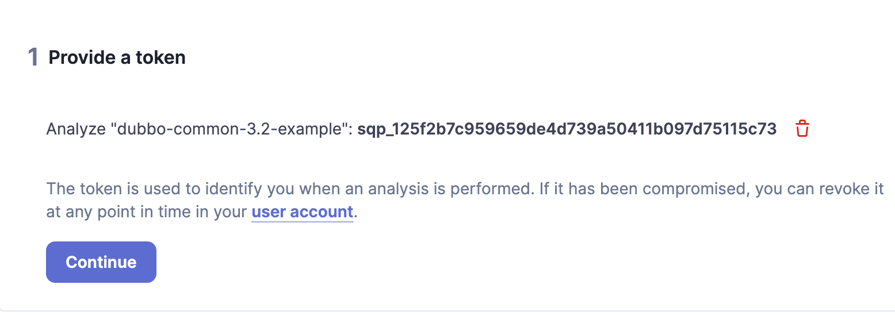
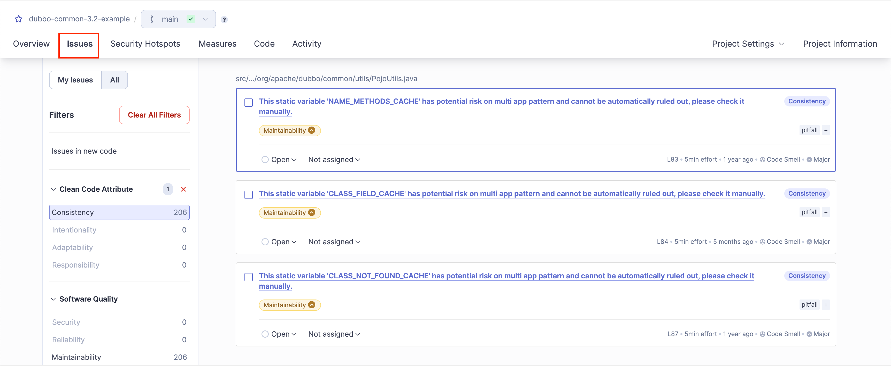
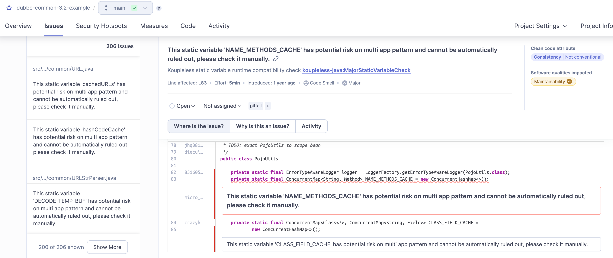

# Koupleless 代码扫描工具
Koupleless 是一个模块体系，在引入极速研发体验的同时，也会引入单进程多应用模式的兼容性问题。
具体为什么会引入兼容性问题可以参照[官网文档](todo official documents)。
为了帮助用户更有效率地发现问题，我们提供了代码扫描工具，识别常见的不兼容模式，赋能用户有的放矢地进行代码调整。

# 架构设计
Koupleless 在流行的开源扫描工具 SonarQube 的基础上提供了自定义插件用以识别常见的不兼容模式。
用户可以部署 SonarQube 服务端，用以查看扫描结果，然后通过 SonarQube CLI 来触发扫描代码识别不兼容模式。

## 部署 SonarQube 服务
### 已有 SonarQube 进程
如果用户已有 SonarQube 进程, 并且版本大于 9.5, 可以直接安装插件，步骤如下：
1. 从 [Koupleless Java 代码扫描插件](https://oss.sonatype.org/#nexus-search;quick~koupleless-java-sonar-plugin) 下载插件 jar 包
2. 将 jar 包放到 SonarQube 的插件目录下：`$SONARQUBE_HOME/lib/extensions/`

### 没有 SonarQube 进程
可以通过项目的 docker/server 目录下的 Dockerfile 来构建一个 SonarQube 服务。
构建完成后，可以使用 docker/server 的 docker-compose.yml 配置文件来启动服务。
当然，相关的运维人员也可以参照 docker-compose 的逻辑，然后通过其他方式，比如 k8s 来部署服务。
SonarQube 的依赖是轻量的，只依赖一个关系型数据库，所以实际镜像化部署是比较简单的，这里不再赘述。

# 常见工作流
## 步骤一: 在 SonarQube Web 页面新建一个代码仓库。

</br>
注意，此处的 branch 是 sonarqube 自己的概念，和 git 的 branch 没有关系。
## 步骤二: 将仓库关联到 Koupleless 代码扫描的 Profile。

</br>

## 步骤三: 选择本地触发代码扫描，获取 token。

</br>


</br>

## 步骤四: 触发扫描任务。
由于执行 SonarQube CLI 要求本地 jdk 版本在 jdk17 以上，而用户的本地 jdk 版本可能不满足要求，所以提供了两种方式来触发扫描任务。
注意，SonarQube CLI 要求的版本和用户真实工程需要的版本没有关联关系，用户的工程可以是任何版本的 jdk。
### 本地 jdk 版本在 jdk17 以上
使用 mvn 命令直接执行。
```shell
# 在工程根目录下执行以下命令
mvn verify -DskipTests=true sonar:sonar \
  -Dsonar.projectKey=your_project_key \
  -Dsonar.projectName='your_project_name' \
  -Dsonar.host.url=http://your_server_ip:your_server_port \
  -Dsonar.token=sqp_the_web_token \
  -Dsonar.language=java
```

### 本地 jdk 版本小于 jdk17
建议参照 SonarQube 的[官方文档](https://docs.sonarsource.com/sonarqube/latest/analyzing-source-code/scanners/sonarscanner/#sonarscanner-from-docker-image)的 docker 封装好的 cli 命令来使用 SonarQube CLI。

## 步骤五: 在仓库的 Issue 页面浏览问题。

</br>

## 步骤六: 排查、确认、修复 Issue。

</br>

# 扫描规则维护
- Java: [扫描规则](./koupleless-java-sonar-plugin/README.md)
